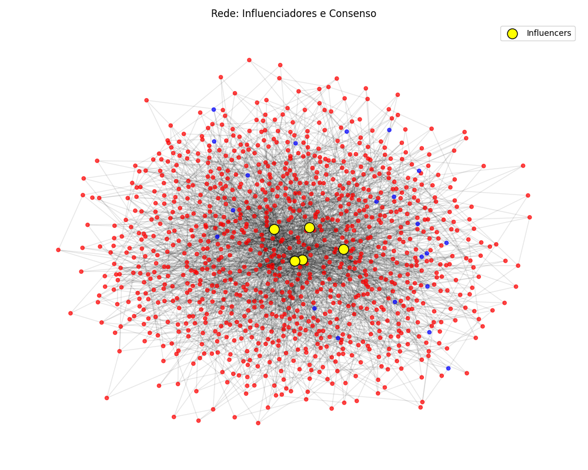
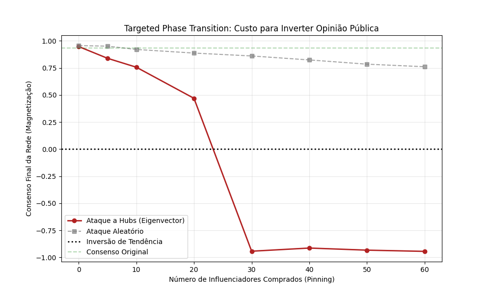

# Protocolo FT-PHY-001: Sistema de Inteligência Sociofísica

> "O mercado não é uma caixa preta. É um Banho Térmico de intenções humanas governado pela Mecânica Estatística."

Este repositório contém o **Framework Completo** desenvolvido para transpor barreiras entre Física Teórica e Inteligência de Mercado. Ele opera em três fases distintas: **Simulação**, **Observação** e **Engenharia**.

---

## 📂 Estrutura do Projeto (Organizada)

*   `src/`: Código fonte das engines de inteligência.
    *   `social_ising.py`: Simulação de Monte Carlo.
    *   `reddit_market_scanner.py`: Scanner de Portfólio.
    *   `reddit_pain_mapper.py`: Analisador Semântico.
*   `relatos/`: Relatórios de inteligência e análise estratégica.
    *   `01_simulacao_teorica_ataque.md`: Tipping Point (3%).
    *   `02_radar_oportunidades_mercado.md`: Gold Rush List.
    *   `03_engenharia_memetica_oferta.md`: Engenharia de Copy.
*   `docs/`: Documentação Acadêmica e Técnica.
    *   `paper.md`: Artigo científico fundamental.
    *   `FT-PHY-001...`: Protocolo original.
*   `assets/`: Galeria visual.

---

## 🎨 Galeria de Resultados

### Análise de Redes (Simulação)



### Inteligência de Mercado (Reddit Data)


---

## 🚀 Como Executar

1.  **Instalação**:
    ```bash
    pip install numpy networkx matplotlib scipy pandas requests
    ```

2.  **Execução das Engines (via raiz)**:

    *   **Simulação Teórica**:
        ```bash
        python src/social_ising.py
        ```
    *   **Scanner de Mercado**:
        ```bash
        python src/reddit_market_scanner.py
        ```
    *   **Mapeador de Dores**:
        ```bash
        python src/reddit_pain_mapper.py
        ```

3.  **Ler Documentação**:
    Consulte a pasta `docs/` para aprofundamento teórico.

---
**Status**: Operacional.
**Paper Científico**: Veja `docs/paper.md` para a fundamentação matemática.
