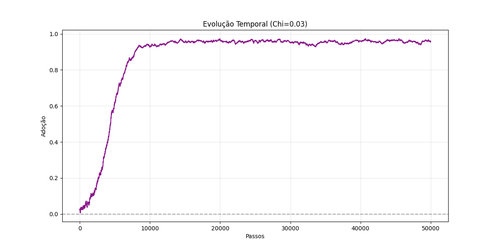

# Projeto Ising Social: Simulação e Controle de Redes Complexas

Este projeto aplica conceitos de **Física Estatística (Modelo de Ising)** sobre topologias de rede **Scale-Free (Barabási-Albert)** para modelar, analisar e controlar a propagação de tendências e formação de bolhas sociais.

O objetivo é fornecer uma ferramenta analítica para entender a dinâmica de consenso, polarização e vulnerabilidade de redes sociais a ataques direcionados.

---

## 📂 Estrutura do Projeto

*   `social_ising.py`: **Engine de Simulação**. Código Python contendo a lógica de Monte Carlo, métricas de rede (Louvain, Centralidade) e visualização.
*   `relatos/`: Relatórios de inteligência e análise estratégica dos experimentos.
    *   `relatorio_final_inteligencia.md`: Autópsia completa da operação de inversão de tendência.
*   `paper.md`: Artigo científico formal descrevendo a metodologia e resultados físicos.
*   `assets/`: Galeria de artefatos visuais gerados.

---

## 📊 Galeria de Resultados

### 1. Evolução e Estabilidade
Acompanhamento temporal da adoção de uma tendência. Observe a saturação rápida (curva sigmóide) indicando "viralização".



### 2. Anatomia da Rede e Influenciadores
Visualização da estrutura topológica. Os nós maiores e amarelos são os **Hubs** (Influenciadores). Note como o consenso (cor dos nós) se cristaliza ao redor deles.


### 3. Cartografia de Bolhas
Detecção de comunidades via Algoritmo de Louvain. Identifica "câmaras de eco" e bolhas autossustentáveis (orgânicas).


### 4. O Ponto de Ruptura (Tipping Point)
**Resultado Mais Crítico**: Gráfico demonstrando a fragilidade da rede. A linha vermelha mostra que comprometer apenas **3% dos nós (Hubs)** inverte a opinião da rede inteira (Transição de Fase). A linha cinza mostra a inutilidade de tentar influenciar usuários aleatórios.


---

## 🚀 Como Executar

1.  Instale as dependências:
    ```bash
    pip install numpy networkx matplotlib scipy
    ```
2.  Execute a simulação:
    ```bash
    python social_ising.py
    ```

## 🔬 Fundamentação Científica

Baseado no Hamiltoniano Social:
$$ H = -J \sum_{\langle i,j \rangle} s_i s_j - h \sum_i s_i $$

Onde a competição entre $J$ (pressão social) e $h$ (algoritmo/marketing) define se a rede entra em um estado de **Ordem Ferromagnética** (Consenso/Bolha) ou **Desordem Paramagnética** (Ruído).

---
**Desenvolvido sob protocolo FT-PHY-001 - Física Teórica Computacional.**
