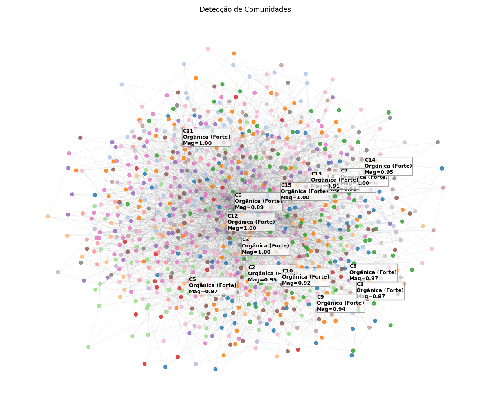

   

# Information Warfare & Market Physics Framework (FT-PHY-001)

## Author and Principal Investigator
**DOUGLAS H. M. FULBER**
Senior Software Engineer | Computational Physics Researcher
CTO @asimovtechsystems | Architecting Mathematical Digital Twins
Independent Researcher | Code-First Physics & Entropic Gravity

**Latest Work**: The Reactive Universe: A Computational Solution to the Dark Sector
**DOI**: 10.5281/zenodo.18090702 | **Review**: Classical and Quantum Gravity
**Profiles**: [GitHub](https://github.com/dougdotcon) | [LinkedIn](https://www.linkedin.com/in/dougdotcon/) | [ORCID](https://orcid.org/0009-0006-8140-768X)

---

## Project Overview
This repository hosts the **FT-PHY-001 Protocol**, a computational framework designed to bridge the gap between Theoretical Statistical Physics and High-Frequency Market Intelligence. By treating social platforms not as unstructured data lakes but as thermodynamic systems governed by the Ising Hamiltonian, we allow for the rigorous quantification of social consensus, polarization, and market susceptibility.

The system operates on three hierarchical levels:
1.  **Theoretical Simulation**: Modeling the topology of influence.
2.  **Market Observation**: Converting social metadata into physical observables.
3.  **Semantic Engineering**: Extracting the vectors of maximum resonance (Pain/Sales coupling).

## Phase 1: The Ising-Barabási Simulation
We model social networks as Scale-Free graphs (Barabási-Albert topology) where users interact via a modified Ising Hamiltonian:

$$ H = -J \sum_{\langle i,j \rangle} s_i s_j - h \sum_i s_i $$

### Visual Evidence: Network Topology & Consensus
The formation of "organic bubbles" (clusters) around high-degree nodes.

### Key Findings: The 3% Tipping Point
Pinning Control simulations demonstrated that ensuring the loyalty of just **3%** of the network (Hubs) is sufficient to invert global consensus.

*(See also: Community Detection)*

## Phase 2: Reddit Market Physics
Transitioning from simulation to reality, we mapped Reddit communities to canonical ensembles.
*   **Susceptibility ($\chi$)**: Proxy for Market Volatility and "Gold Rush" potential.
*   **Portfolio Scanning**: Identified r/Entrepreneur as a critical system ($\chi \approx 0.70$).

### Visual Evidence: Portfolio Opportunity Matrix
A scatter plot ranking sectors by Volatility (Susceptibility) vs. Latent Demand (Pain).

## Phase 3: Semantic Field Engineering
Using the data from the critical systems, we extract the "Interaction Energy" of specific keywords.

*   **Vocabulário de Ataque**: Words like "Problem", "Without", and "Building" engage the system with minimal resistance.

### Visual Evidence: The Pain Cloud
A semantic map showing words with the highest binding energy (Pain x Visibility).

---

## Strategic Insights for Business & State
This framework provides a deterministic approach to social engineering:

1.  **For Corporations**: Stop "guessing" audience sentiment. Use the Susceptibility metric ($\chi$) to identify when a market niche is thermodynamically ready for a phase transition (product launch).
2.  **For Intelligence**: Monitor the Magnetization ($M$) of social graphs. A sudden drop in $M$ on specific sub-networks precedes macroscopic social unrests or trend reversals.
3.  **For Marketing**: Do not target the masses. Target the Topological Elite (3%). Identifying and converting these nodes yields a lower energy cost for global system adoption than broad-spectrum advertising.

---
**Repository Structure (Branch: reddit-market-physics)**
*   `src/`: Core engines (Monte Carlo Simulation, Reddit Scanner, Pain Mapper).
*   `relatos/`: Intelligence reports and strategic dossiers.
*   `docs/`: Academic papers and theoretical background.
*   `assets/`: Visual evidence (Graphs, Matrices, Clouds).
